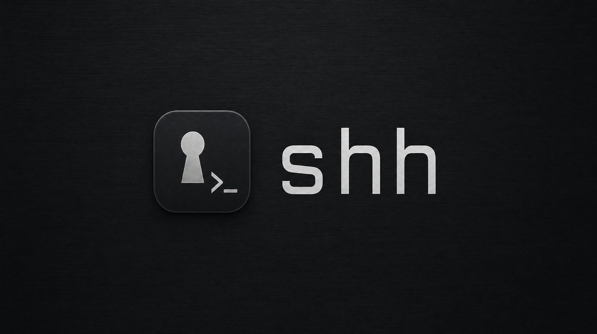
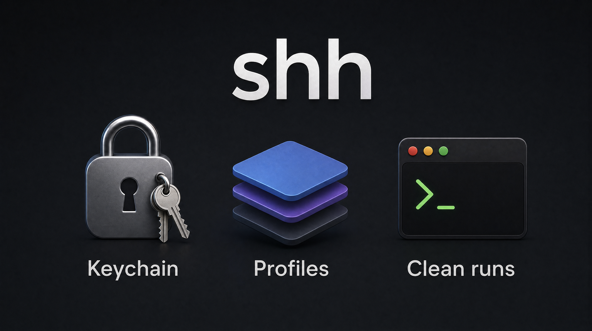

# shh

<p align="center">
  
</p>

> Stop sourcing `.env` files. Keep your secrets where macOS already keeps them.

`shh` is a small macOS CLI that stores environment-variable secrets in the
login Keychain and hands them to your shells, scripts, and child processes
on demand.

```sh
shh set OPENAI_API_KEY                  # hidden prompt
eval "$(shh export -p work)"            # load the 'work' profile into the current shell
shh run -p work --clean -- pytest       # run pytest with only profile vars + a safe baseline
```

## Why this instead of `.env`?

Be honest with yourself for a second. How many of these are true?

- A `.env` file in `~/projects/$thing/` for every project you've touched.
- Half of them have your real `OPENAI_API_KEY` in them.
- `.env` is in `.gitignore` *most* of the time. You once committed one. You
  remember which one.
- Your `~/.zshrc` exports `ANTHROPIC_API_KEY="sk-ant-…"` because it was easier.
- Your editor, your AI agent, your `find ~ -type f`, your shell history,
  your last `tar` of `~/projects` — all of them have read those keys.
- iCloud Drive backed up some of them. So did Time Machine, in plaintext.
- You can't remember the last time you rotated any of them.

The Keychain solves all of this without you having to be disciplined:

- **One place.** Every secret lives in `login.keychain`, namespaced by
  profile. No more `find ~ -name '.env*'`. `shh ls` shows you everything.
- **Encrypted at rest.** The Keychain is encrypted with a key derived from
  your login password. A stolen laptop with FileVault on (which you have
  on, right?) is a brick; without FileVault the Keychain is still
  encrypted. A `.env` file is just bytes anyone with read access can `cat`.
- **Access-controlled per app.** macOS prompts the first time a binary
  reads an item and remembers your answer. A rogue script can't just `cat
  ~/.env` — it has to be a binary you've explicitly trusted. (`shh` signs
  itself for exactly this reason; see *Why signing matters*.)
- **Not in your shell env by default.** The biggest leak vector for `.env`
  is `export FOO=…` in your shell rc — every child process you spawn
  inherits it. With `shh`, secrets are loaded only into the shell or
  command that needs them (`shh run -- pytest`, `eval "$(shh export)"`),
  and `--clean` strips everything else.
- **Not in git, not in backups-as-plaintext, not in your editor's recent
  files, not in `tar`, not in iCloud sync.** The Keychain is its own
  encrypted store; it won't get accidentally checked in or uploaded.
- **Auditable in one place.** Open Keychain Access, search for the
  service prefix `shh:`, and you can see every secret macOS has on your
  behalf — when it was created, when it was last modified, which apps
  have been granted access. Try doing that with `.env` files.
- **Scriptable rotation.** `shh set OPENAI_API_KEY` once and every project
  picks up the new value on the next `shh run`. No grep-and-replace
  through fifteen `.env` files.

You're already trusting the Keychain with your Wi-Fi password, your AWS
SSO token, every browser autofill credential, and the cert chain that
boots your machine. Putting `OPENAI_API_KEY` next to them is just
finishing the job.

Secrets live in the Keychain as ordinary generic-password items — visible
in Keychain Access, protected by the same access controls macOS already
applies to everything else, and removed when you `shh rm` them. No daemon,
no extra config file, no proprietary vault format.

## Status

v1.0 — macOS only. Tested against macOS 14+ on Apple Silicon and Intel.

## Install

```sh
cargo install --path .          # quick, unsigned, fine for a tire-kick
just install                    # signs the binary so the Keychain stops re-prompting
```

The first form is good for poking around. The second form is what you want
for daily use — see *Why signing matters* below.

If you don't have Cargo installed, the easiest path is:

```sh
nix develop                     # drops you in a shell with rustc, cargo, just
just install
```

### Why signing matters

The macOS login Keychain identifies trusted apps by code-signing
**designated requirement**, not by file path or hash. An unsigned (or
ad-hoc-signed) binary changes identity every time it's rebuilt, so the
"Always Allow" you clicked yesterday won't apply to today's `cargo build`
output. You'll get prompted on every read.

`just install` fixes this by signing with a stable identity. It picks up,
in order:

1. An `Apple Development` or `Developer ID Application` cert in your login
   keychain (most developers already have one — Xcode adds it).
2. A self-signed `shh-codesign` cert created by `just setup-codesign`.

Check what you have:

```sh
security find-identity -v -p codesigning
```

If you see nothing, run `just setup-codesign` once (it generates a
self-signed cert and trusts it for code signing — you'll get one macOS
password prompt). Then `just install` will use it forever after.

<p align="center">
  
</p>

## Usage

### Storing and listing

```sh
shh set OPENAI_API_KEY                          # prompts hidden
shh set DATABASE_URL postgres://localhost/dev   # value as positional arg
shh set ANTHROPIC_API_KEY -p work               # under the 'work' profile
echo $TOKEN | shh set SOME_TOKEN                # piped from stdin
shh ls                                          # names in 'default'
shh ls -p work                                  # names in 'work' (with source markers)
shh profiles                                    # all profiles you've created
shh get OPENAI_API_KEY                          # print value (refuses if stdout is a TTY)
shh rm OLD_KEY -p work
```

### Loading into your shell

```sh
eval "$(shh export)"                            # 'default' profile
eval "$(shh export -p work)"                    # 'work' overlays 'default'
eval "$(shh unset -p work)"                     # remove those names from the current shell
shh export --format json | jq .                 # JSON object for tools
shh export -p work --format dotenv > .env.work  # dotenv for non-shell consumers
```

`export` and `unset` refuse to write to a terminal — they're meant to be
piped through `eval` or redirected to another consumer.

### Running a child process

```sh
shh run -p work -- pytest                       # pytest sees default + work overlay
shh run -p prod --clean -- ./deploy.sh          # only prod's vars + PATH/HOME/USER/SHELL/TERM/LANG/LC_*/TMPDIR
```

`run` propagates the child's exit code. `--clean` is the right flag for
sandboxed scripts that should not inherit your interactive shell's env.

### Bulk-loading from a `.env` file

```sh
shh load ~/Projects/cortex/.env.dev             # interactive checklist
shh load ~/.env --all -p prod                   # everything, into 'prod'
shh load ~/.env --only OPENAI_API_KEY,DB_URL    # subset
shh load ~/.env --except DEBUG,LOG_LEVEL        # everything but these
shh load ~/.env --all --dry-run                 # preview, no writes
```

`shh` parses a strict subset of `.env` — single/double quotes, line
continuations, comments. It does **not** evaluate `$(...)`, backticks, or
`${VAR:-default}`; entries that need expansion are rejected with a warning
rather than silently mis-imported.

### Profiles

A profile is just a string slug (`default`, `work`, `prod`, `client-acme`).
Reads and `run`/`export` resolve the **`default` profile plus the named
overlay** — overlay wins on conflict. There is no global state to manage:
profiles exist when they have at least one item.

### Shell completions

```sh
shh completions zsh > ~/.zsh/completions/_shh
shh completions bash > /usr/local/etc/bash_completion.d/shh
shh completions fish > ~/.config/fish/completions/shh.fish
```

### Health check

```sh
shh doctor keychain
```

Writes a probe item under `__shh_doctor__`, reads it back, lists it,
deletes it, and reports the Keychain identity it's signing with. Run this
if reads start prompting again — usually means the binary was rebuilt
without re-signing.

## Configuration

Two environment variables, both optional:

| Var | Default | Purpose |
|---|---|---|
| `SHH_KEYCHAIN` | `file` | `file` (login keychain) or `data-protection` (modern; needs entitlements). |
| `SHH_SERVICE_PREFIX` | `shh` | Item service is `<prefix>:<profile>`. Set this to silo dev/test runs. |

## How it works

Each secret is stored as a macOS generic-password Keychain item:

- `service` = `<SHH_SERVICE_PREFIX>:<profile>`  (e.g. `shh:work`)
- `account` = `<NAME>`  (e.g. `OPENAI_API_KEY`)
- `password` = the value

`shh ls` and `shh profiles` use **attribute-only** Keychain searches —
they never request the password data, so they don't trigger access
prompts. Only commands that actually need the value (`get`, `export`,
`run`, `load --dry-run=false` reads-then-writes for diff) hit the
authentication path.

## Hacking

```sh
nix develop          # rustc, cargo, just, Security.framework headers
just                 # = just ci  (fmt-check + clippy -D warnings + tests)
just test            # cargo test --all
just smoke-keychain  # exercises the real Keychain under a sandbox prefix
```

The repo follows a chapter-based plan-then-execute workflow; the v1 plan
lives at `thoughts/arcs/20260514_shh-v1-macos-cli/`. The detailed spec is
`docs/prd-ticket.md`.

## Roadmap

v1 is intentionally tight. Things that might land in v1.x:

- TouchID / Apple Watch unlock for `get` / `export` (`SecAccessControl` flags).
- Linux backend (Secret Service / `libsecret`).
- Per-item TTL / expiry attributes.

If one of these is a blocker for you, open an issue and say so — that's
the easiest way to move it up.

## Contributing

Bugs and small PRs welcome. For anything bigger than a one-file fix, open
an issue first so we can talk shape before you write code. Please run
`just ci` before sending.

## License

MIT. See [LICENSE](LICENSE).
